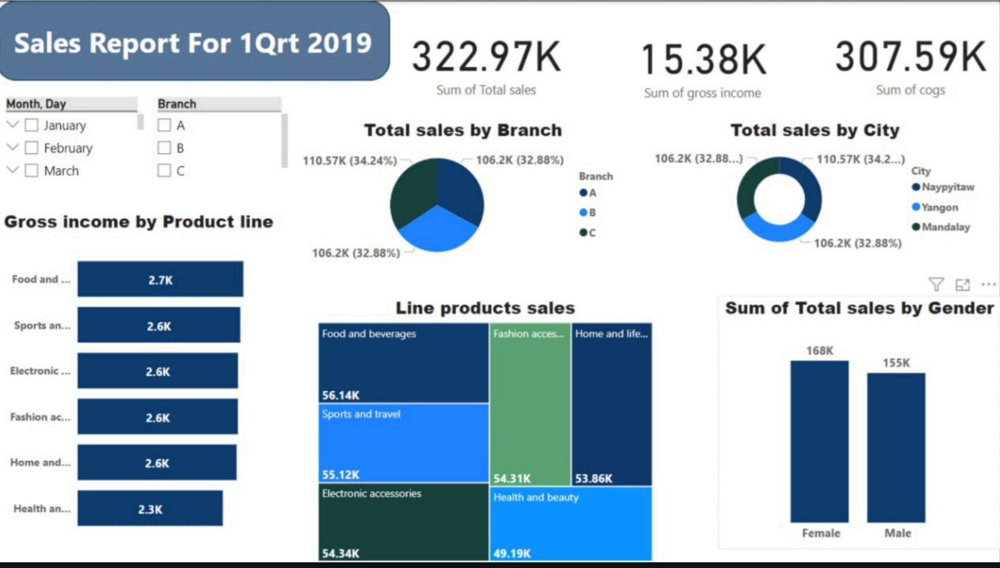
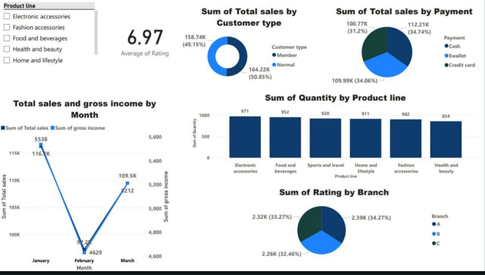
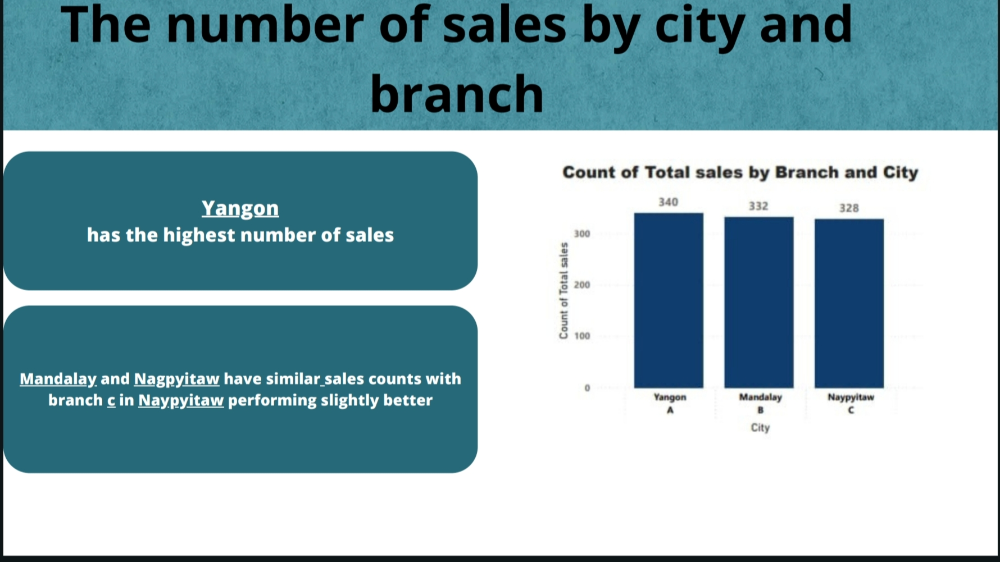

# 📊 Supermarket Sales Analysis Project

## 🔎 Introduction  
Welcome to the **Supermarket Sales Analysis Project**, where we leverage data insights to optimize retail performance. Using Power BI, we crafted a dynamic dashboard to visualize and analyze trends, customer preferences, and sales patterns.  

---

## 🖼️ Overview  
Here are snapshots of the interactive Power BI dashboard created for this project:  

### Dashboard 1  
  

### Dashboard 2  
  

### Dashboard 3  
  

---

## 🎯 Objective  
- To understand key sales drivers and customer behaviors.  
- To identify top-performing products, cities, and payment methods.  
- To provide actionable insights to improve customer satisfaction and increase revenue.  

---

## 🔍 Scope of Analysis  
1. **Sales Trends:** Monthly, daily, and hourly sales performance.  
2. **Customer Behavior:** Preferences by city, branch, and gender.  
3. **Product Performance:** Analysis of product lines and gross income.  
4. **Payment Methods:** Popularity and impact on total sales.  
5. **Customer Ratings:** Satisfaction scores and their variations.  

---

## 🛠️ Technology and Tools  
- **Dataset:** [Kaggle - Supermarket Sales Dataset](https://www.kaggle.com/datasets/arunjangir245/super-market-sales)  
- **Visualization Tool:** Power BI  
- **Analysis Techniques:** Exploratory Data Analysis (EDA), trend analysis, and visual storytelling.  

---

## 📊 Insights Uncovered  
- **Top Performing City:** Yangon leads in sales volume.  
- **Preferred Payment Method:** Ewallet (34.7%) is the most used.  
- **Best Product Lines:** Food & Beverages and Fashion Accessories dominate sales.  
- **Average Customer Rating:** 6.97/10, indicating a generally positive experience.  
- **Peak Sales Hours:** Sales peak during late afternoons and evenings.  

---

## 💡 Insights and Recommendations  
1. **Focus Marketing in Yangon:** Target campaigns to sustain high sales performance.  
2. **Promote Popular Payment Methods:** Encourage Ewallet usage through discounts or rewards.  
3. **Optimize Inventory:** Prioritize stocking best-selling product lines.  
4. **Enhance Customer Experience:** Address lower ratings by improving service quality.  

---

## 📩 Contact  
💼 Created by **Shimaa Alaa**  
📧 Email: shimaaalaagomaa@gmail.com  
🔗 [LinkedIn Profile](https://www.linkedin.com/in/shimaa-alaa5)
